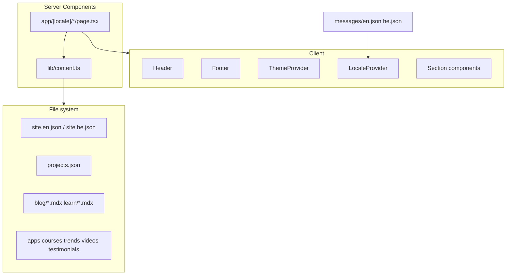

# Architecture

## Overview

**ordel-webside** is a bilingual (English / Hebrew) portfolio for **Or Delevski**, built with Next.js App Router. All content is file-based (JSON + MDX); there is no database or CMS.

**Design reference:** [yuv.ai](https://yuv.ai/) — homepage aggregation + dedicated section routes.  
**Content source:** [protfolio-tau-puce.vercel.app](https://protfolio-tau-puce.vercel.app/) — migrated identity, experience, and projects.

## Stack

| Layer | Choice | Version (package.json) |
|-------|--------|-------------------------|
| Framework | Next.js App Router | 16.2.6 |
| UI | React | 19.2.4 |
| Styling | Tailwind CSS | 4.x |
| Motion | Framer Motion | 12.x |
| Icons | lucide-react | 1.16.x |
| Content parsing | gray-matter | 4.x |
| MDX | next-mdx-remote (RSC) | 6.x |
| Utilities | clsx, tailwind-merge | — |

## High-level structure



## Directory layout

```
app/
  layout.tsx                 # Root: fonts, ThemeProvider, VideoBackground, theme init script
  globals.css                # Design tokens; [data-theme="light"] overrides
  [locale]/
    layout.tsx               # Header, Footer, LocaleProvider, generateStaticParams
    page.tsx                 # Homepage — composes 10 section components
    about/page.tsx           # Bio, highlights, experience, CV button
    projects/page.tsx        # Full project grid
    blog/page.tsx + [slug]/  # MDX blog
    learn/page.tsx + [slug]/ # MDX tutorials
    academy/page.tsx         # Course cards
    apps/page.tsx            # App showcase
    contact/page.tsx         # ContactForm + social
    privacy/page.tsx
  api/trends/route.ts        # Mock trends endpoint
  sitemap.ts                 # All locales × static + dynamic slugs
  robots.ts

components/
  layout/     Header, Footer, VideoBackground, ThemeToggle, LocaleSwitcher
  providers/  ThemeProvider, LocaleProvider, SetHtmlLangDir
  sections/   Hero, *Preview, TrendsSection, ExperienceSection, etc.
  ui/         Button, Card, Section, Badge, Marquee, PageHeader
  contact/    ContactForm (client, mailto submit)
  providers/  LocaleProvider, SetHtmlLangDir

lib/
  content.ts      # server-only — all fs reads
  constants.ts    # navLinks, logoPartners, HERO_VIDEO_SRC, HERO_VIDEO_SRC_LIGHT, THEME_STORAGE_KEY
  theme.ts        # applyTheme, getStoredTheme, persistTheme
  mdx.tsx         # compileMDX wrapper
  types.ts        # SiteConfig, Project, MdxDoc, etc.
  utils.ts        # cn()
  i18n/
    config.ts           # locales: en | he, isRtl
    get-dictionary.ts   # loads messages/{locale}.json
    navigation.ts       # localizedPath()

content/
  site.en.json / site.he.json   # Identity, experience, contact, social
  projects.json                 # 17 projects, LocalizedString descriptions
  apps.json, courses.json       # Placeholder products
  testimonials.json, videos.json, trends.json
  blog/*.mdx (3), learn/*.mdx (3)

messages/
  en.json, he.json              # Nav, footer, section titles, page copy keys

public/
  Or-Delevski-CV.pdf            # CV download asset

.cursor/
  skills/session-continuity/    # Agent handoff workflow
  hooks/                        # sessionStart, postToolUse, sessionEnd
  rules/project-memory.mdc      # Mandatory read/update docs
  agent-sessions/               # HANDOFF.md, per-session logs
```

## i18n architecture

| Concern | Implementation |
|---------|----------------|
| URL | Prefix `/{locale}/` — `en` default, `he` RTL |
| Validation | `isValidLocale()` in layout → `notFound()` |
| Marketing copy | `getSiteConfig(locale)` → `site.{locale}.json` |
| UI chrome | `getDictionary(locale)` → `messages/{locale}.json` |
| Shared entities | `projects.json` with `{ en, he }` description objects |
| RTL | `isRtl(locale)` on sections; Heebo font; `dir` on forms |
| Links | `localizedPath(locale, "/projects")` |

## Content loading pattern

```typescript
// lib/content.ts — MUST stay server-only
import "server-only";
import fs from "fs";
// readJson("site.en.json") | getMdxDocs("blog") | etc.
```

**Rule:** Client components must not import `lib/content.ts`. Pass data as props from Server Components.

## Homepage composition

`app/[locale]/page.tsx` renders in order:

1. `Hero` — tagline, badges, CV + projects CTAs  
2. `Marquee` — partner logos  
3. `BlogPreview`  
4. `LearnPreview`  
5. `TrendsSection` — client fetch `/api/trends`  
6. `YouTubeSection`  
7. `AppsPreview`  
8. `ProjectsPreview` — top featured projects  
9. `AcademyPreview`  
10. `TestimonialsSection`  
11. `ConnectSection`  

Root `app/layout.tsx` wraps all pages with `ThemeProvider` and `VideoBackground` (CloudFront MP4; source swaps on `data-theme="light"`).

## API: trends

`GET /api/trends`:

- 800ms artificial delay
- Returns `getMockTrends()` from `content/trends.json`
- Consumed by client `TrendsSection`

## SEO

- `NEXT_PUBLIC_SITE_URL` env (default `https://ordel.dev` in sitemap)
- Per-page `generateMetadata` using dictionary titles
- Sitemap: static routes × 2 locales + blog/learn slugs × 2 locales

## Agent memory (meta)

| Layer | Path | Role |
|-------|------|------|
| Long-term project | `docs/*.md` | Architecture, state, decisions, roadmap |
| Last session | `memory/session-summary.md` | Short summary |
| Agent handoff | `.cursor/agent-sessions/HANDOFF.md` | Injected on sessionStart |
| Tool audit | `sessions/*/tool-log.md` | Hook-generated (gitignored) |

See `.cursor/rules/project-memory.mdc` and [session-history.md](session-history.md).
